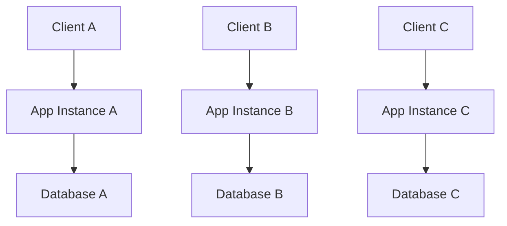
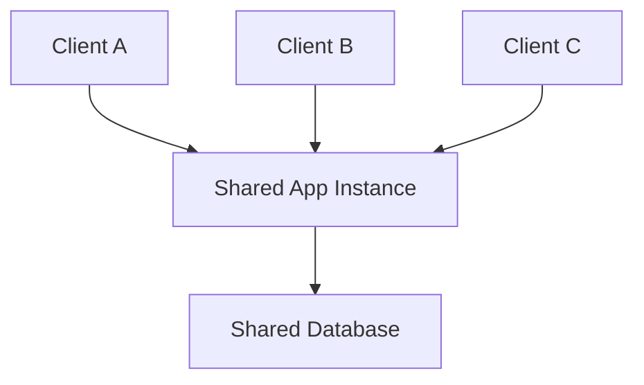
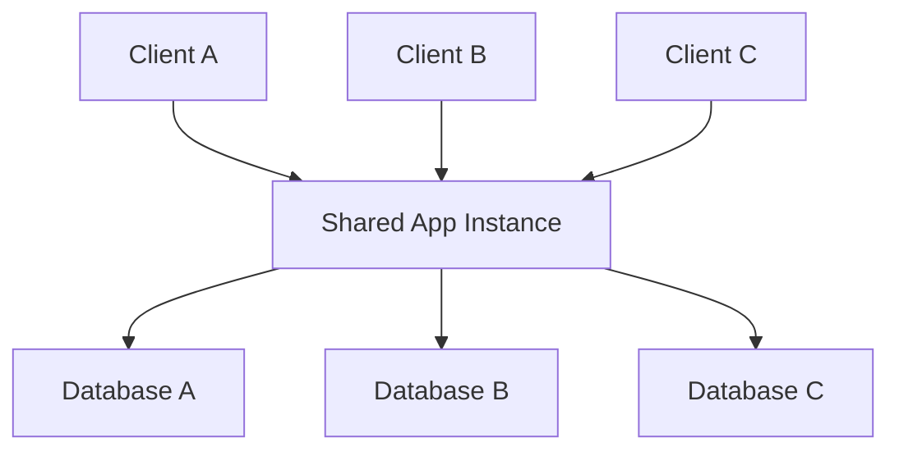

# Building Multi-Tenant SaaS Applications with ASP.NET Core (.NET 8+) and CI/CD Best Practices

A comprehensive guide for engineers, architects, and engineering managers designing scalable SaaS platforms.

## Table of Contents
1. [Introduction](#introduction)
2. [Tenancy Models](#tenancy-models)
3. [Tenant Resolution Strategies](#tenant-resolution)
4. [Identity and Authentication](#identity-authentication)
5. [Configuration and Feature Flags](#configuration-features)
6. [CI/CD Strategies](#cicd-strategies)
7. [Best Practices](#best-practices)
8. [Implementation Examples](#implementation-examples)

## Introduction {#introduction}

Multi-tenant SaaS applications serve multiple customers (tenants) from a single application instance, providing significant cost efficiency and scalability benefits while introducing complexity in data isolation, configuration management, and deployment processes.

### Key Challenges
- **Data Isolation**: Ensuring one tenant never sees another's data
- **Performance Interference**: Preventing "noisy neighbor" problems
- **Per-Tenant Customization**: Managing feature variations across tenants
- **Deployment Management**: Minimizing impact during updates

## Tenancy Models {#tenancy-models}

### 1. Single-Tenant (Dedicated Instances)

Each tenant gets a completely separate instance.



**Pros:**
- Strong isolation
- Maximum customizability
- Independent scaling

**Cons:**
- High infrastructure costs
- Complex operations
- Limited scalability

### 2. Fully Shared Multi-Tenant

All tenants share the same application instance.



**Pros:**
- Maximum cost efficiency
- Simplified deployment
- Easy global analytics

**Cons:**
- Data isolation risks
- Noisy neighbor problems
- Global impact of changes

### 3. Database-per-Tenant

Shared application, separate databases.



**Pros:**
- Strong data isolation
- Mitigates DB-level noisy neighbors
- Independent data scaling

**Cons:**
- More resources to manage
- Complex migrations
- Cross-tenant analytics harder

## Tenant Resolution Strategies {#tenant-resolution}

### 1. Subdomain-Based Resolution

```csharp
app.Use(async (context, next) =>
{
    string host = context.Request.Host.Host;
    string subdomain = host.Split('.')[0].ToLower();
    
    var tenant = await tenantService.GetTenantBySubDomainAsync(subdomain);
    if (tenant == null)
    {
        context.Response.StatusCode = 404;
        await context.Response.WriteAsync("Tenant not found");
        return;
    }
    
    context.Items["Tenant"] = tenant;
    await next.Invoke();
});
```

### 2. Path-Based Resolution

```csharp
app.Use(async (context, next) =>
{
    var segments = context.Request.Path.Value
        .Split('/', StringSplitOptions.RemoveEmptyEntries);
    
    if (segments.Length > 0)
    {
        var tenant = await tenantService.GetTenantByIdAsync(segments[0]);
        if (tenant != null)
        {
            context.Items["Tenant"] = tenant;
            context.Request.Path = "/" + string.Join('/', segments.Skip(1));
        }
    }
    
    await next();
});
```

### 3. Claims-Based Resolution

```csharp
public class TenantMiddleware
{
    public async Task InvokeAsync(HttpContext context, ITenantService tenantService)
    {
        if (context.User?.Identity?.IsAuthenticated == true)
        {
            var tenantClaim = context.User.FindFirst("tenant_id")?.Value;
            if (tenantClaim != null)
            {
                var tenant = await tenantService.GetTenantByIdAsync(tenantClaim);
                context.Items["Tenant"] = tenant;
            }
        }
        
        await _next(context);
    }
}
```

## Identity and Authentication {#identity-authentication}

### Multi-Tenant ASP.NET Core Identity

```csharp
// Custom IdentityUser with TenantId
public class MultiTenantUser : IdentityUser
{
    public string TenantId { get; set; }
}

// Custom UserStore with tenant filtering
public class MultiTenantUserStore : UserStore<MultiTenantUser>
{
    private readonly ITenantProvider _tenantProvider;
    
    public override async Task<MultiTenantUser> FindByNameAsync(
        string normalizedUserName, 
        CancellationToken cancellationToken = default)
    {
        var currentTenant = _tenantProvider.GetCurrentTenant();
        return await Users
            .Where(u => u.NormalizedUserName == normalizedUserName 
                     && u.TenantId == currentTenant.Id)
            .FirstOrDefaultAsync(cancellationToken);
    }
}
```

### EF Core Global Query Filters

```csharp
public class ApplicationDbContext : DbContext
{
    private readonly ITenantProvider _tenantProvider;
    
    protected override void OnModelCreating(ModelBuilder modelBuilder)
    {
        // Apply global query filter for tenant isolation
        modelBuilder.Entity<Order>()
            .HasQueryFilter(o => o.TenantId == _tenantProvider.GetCurrentTenant().Id);
            
        modelBuilder.Entity<Customer>()
            .HasQueryFilter(c => c.TenantId == _tenantProvider.GetCurrentTenant().Id);
    }
    
    public override async Task<int> SaveChangesAsync(CancellationToken cancellationToken = default)
    {
        var currentTenant = _tenantProvider.GetCurrentTenant();
        
        foreach (var entry in ChangeTracker.Entries<ITenantEntity>())
        {
            if (entry.State == EntityState.Added)
            {
                entry.Entity.TenantId = currentTenant.Id;
            }
        }
        
        return await base.SaveChangesAsync(cancellationToken);
    }
}
```

## Configuration and Feature Flags {#configuration-features}

### Azure App Configuration

```csharp
public class TenantConfigurationService
{
    public async Task<TenantConfiguration> GetTenantConfigurationAsync(string tenantId)
    {
        var configBuilder = new ConfigurationBuilder();
        
        configBuilder.AddAzureAppConfiguration(options =>
        {
            options.Connect(connectionString)
                   .Select($"{tenantId}:*", LabelFilter.Null)
                   .Select("Common:*", LabelFilter.Null);
        });
        
        return configBuilder.Build().Get<TenantConfiguration>();
    }
}
```

### Feature Flags with LaunchDarkly

```csharp
public class TenantFeatureService
{
    private readonly LdClient _ldClient;
    
    public bool IsFeatureEnabled(string featureKey, string tenantId, string userId)
    {
        var context = Context.Builder()
            .Kind("multi")
            .Set("tenant", Context.Builder(tenantId).Name(tenantId).Build())
            .Set("user", Context.Builder(userId).Name(userId).Build())
            .Build();
            
        return _ldClient.BoolVariation(featureKey, context, false);
    }
}
```

## CI/CD Strategies {#cicd-strategies}

### Database Migration for Multiple Tenants

```csharp
public class MultiTenantMigrationService
{
    public async Task MigrateAllTenantsAsync()
    {
        var tenants = await GetAllTenantsAsync();
        var semaphore = new SemaphoreSlim(5); // Limit concurrent migrations
        
        var tasks = tenants.Select(tenant => 
            MigrateTenantWithSemaphoreAsync(tenant, semaphore));
        
        await Task.WhenAll(tasks);
    }
    
    private async Task MigrateTenantWithSemaphoreAsync(Tenant tenant, SemaphoreSlim semaphore)
    {
        await semaphore.WaitAsync();
        try
        {
            await MigrateTenantAsync(tenant);
        }
        finally
        {
            semaphore.Release();
        }
    }
}
```

### Azure DevOps Pipeline

```yaml
stages:
- stage: Deploy
  jobs:
  - deployment: DeployToProduction
    strategy:
      runOnce:
        deploy:
          steps:
          - task: AzureWebApp@1
            displayName: 'Deploy Application'
            inputs:
              azureSubscription: '$(AzureSubscription)'
              appName: '$(AppServiceName)'
              package: '$(Pipeline.Workspace)/**/*.zip'
          
          - task: PowerShell@2
            displayName: 'Run Multi-Tenant Migrations'
            inputs:
              script: |
                $tenants = az sql db list --server $(SqlServerName) 
                foreach ($tenant in $tenants) {
                  dotnet ef database update --connection-string "$(GetConnectionString($tenant))"
                }
```

## Best Practices {#best-practices}

### ✅ Defense in Depth

```csharp
[TenantAuthorize]
public class OrdersController : Controller
{
    [HttpGet("{id}")]
    public async Task<Order> GetOrder(int id)
    {
        // Repository automatically filters by tenant
        var order = await _orderRepository.GetByIdAsync(id);
        
        // Additional validation
        if (order?.TenantId != GetCurrentTenantId())
        {
            throw new UnauthorizedAccessException();
        }
        
        return order;
    }
}
```

### ✅ Comprehensive Logging

```csharp
public class TenantLoggingMiddleware
{
    public async Task InvokeAsync(HttpContext context, ILogger logger)
    {
        var tenant = context.Items["Tenant"] as Tenant;
        
        using (logger.BeginScope(new Dictionary<string, object>
        {
            ["TenantId"] = tenant?.Id,
            ["TenantName"] = tenant?.Name
        }))
        {
            await _next(context);
        }
    }
}
```

### ✅ Automated Testing

```csharp
[TestMethod]
public async Task Orders_ShouldBeIsolatedByTenant()
{
    // Arrange
    var tenant1 = await CreateTenantAsync("tenant1");
    var tenant2 = await CreateTenantAsync("tenant2");
    
    var order1 = await CreateOrderAsync(tenant1.Id);
    var order2 = await CreateOrderAsync(tenant2.Id);
    
    // Act
    var tenant1Orders = await GetOrdersForTenantAsync(tenant1.Id);
    
    // Assert
    Assert.AreEqual(1, tenant1Orders.Count);
    Assert.IsTrue(tenant1Orders.All(o => o.TenantId == tenant1.Id));
}
```

## Implementation Examples {#implementation-examples}

### Complete Tenant Provider

```csharp
public interface ITenantProvider
{
    Tenant GetCurrentTenant();
    Task<Tenant> GetTenantAsync(string identifier);
}

public class TenantProvider : ITenantProvider
{
    private readonly IHttpContextAccessor _httpContextAccessor;
    private readonly ITenantRepository _tenantRepository;
    private readonly IMemoryCache _cache;
    
    public Tenant GetCurrentTenant()
    {
        return _httpContextAccessor.HttpContext?.Items["Tenant"] as Tenant;
    }
    
    public async Task<Tenant> GetTenantAsync(string identifier)
    {
        var cacheKey = $"tenant_{identifier}";
        
        if (_cache.TryGetValue(cacheKey, out Tenant tenant))
        {
            return tenant;
        }
        
        tenant = await _tenantRepository.GetByIdentifierAsync(identifier);
        
        if (tenant != null)
        {
            _cache.Set(cacheKey, tenant, TimeSpan.FromMinutes(30));
        }
        
        return tenant;
    }
}
```

### DI Configuration

```csharp
// Program.cs (.NET 8)
var builder = WebApplication.CreateBuilder(args);

builder.Services.AddMultiTenancy();

var app = builder.Build();

app.UseMiddleware<TenantMiddleware>();
app.UseAuthentication();
app.UseAuthorization();

app.MapControllers();
app.Run();

public static class ServiceCollectionExtensions
{
    public static IServiceCollection AddMultiTenancy(this IServiceCollection services)
    {
        services.AddScoped<ITenantProvider, TenantProvider>();
        services.AddScoped<ITenantRepository, TenantRepository>();
        services.AddTransient<TenantMiddleware>();
        
        services.AddDbContext<ApplicationDbContext>((provider, options) =>
        {
            var tenantProvider = provider.GetService<ITenantProvider>();
            var tenant = tenantProvider?.GetCurrentTenant();
            
            if (tenant != null)
            {
                options.UseSqlServer(tenant.ConnectionString);
            }
        });
        
        return services;
    }
}
```

### Tenant-Aware Repository

```csharp
public class TenantRepository<T> : ITenantRepository<T> where T : class, ITenantEntity
{
    private readonly ApplicationDbContext _context;
    private readonly ITenantProvider _tenantProvider;
    
    public async Task<T> GetByIdAsync(int id)
    {
        var tenant = _tenantProvider.GetCurrentTenant();
        return await _context.Set<T>()
            .FirstOrDefaultAsync(e => e.Id == id && e.TenantId == tenant.Id);
    }
    
    public async Task<T> AddAsync(T entity)
    {
        var tenant = _tenantProvider.GetCurrentTenant();
        entity.TenantId = tenant.Id;
        
        _context.Set<T>().Add(entity);
        await _context.SaveChangesAsync();
        return entity;
    }
}
```

## Security Considerations

### Resource Throttling

```csharp
public class TenantThrottlingMiddleware
{
    public async Task InvokeAsync(HttpContext context)
    {
        var tenant = context.Items["Tenant"] as Tenant;
        if (tenant == null) return;
        
        var quotas = await _quotaService.GetQuotasAsync(tenant.Id);
        var cacheKey = $"tenant_requests_{tenant.Id}_{DateTime.UtcNow:yyyyMMddHH}";
        
        var requestCount = _cache.GetOrCreate(cacheKey, entry =>
        {
            entry.AbsoluteExpirationRelativeToNow = TimeSpan.FromHours(1);
            return 0;
        });
        
        if (requestCount >= quotas.RequestsPerHour)
        {
            context.Response.StatusCode = 429;
            await context.Response.WriteAsync("Rate limit exceeded");
            return;
        }
        
        _cache.Set(cacheKey, requestCount + 1);
        await _next(context);
    }
}
```

### Audit Logging

```csharp
public class TenantAuditService
{
    public async Task LogActionAsync(string action, string entityType, string entityId)
    {
        var tenant = _tenantProvider.GetCurrentTenant();
        var user = _httpContextAccessor.HttpContext?.User;
        
        var auditLog = new AuditLog
        {
            TenantId = tenant?.Id,
            UserId = user?.Identity?.Name,
            Action = action,
            EntityType = entityType,
            EntityId = entityId,
            Timestamp = DateTime.UtcNow
        };
        
        _context.AuditLogs.Add(auditLog);
        await _context.SaveChangesAsync();
    }
}
```

## Common Pitfalls to Avoid

### ❌ Don't Do This

1. **Insufficient Data Isolation**
   - Relying only on client-side filtering
   - Missing tenant validation in API endpoints

2. **Manual Tenant Management**
   - Manual database creation
   - No automated onboarding

3. **Over-Customization**
   - Hard-coding tenant-specific logic
   - Creating branches per tenant

### ✅ Do This Instead

1. **Implement Multiple Layers of Security**
   - Database-level filters
   - Application-level validation
   - Authorization policies

2. **Automate Everything**
   - Tenant provisioning
   - Database migrations
   - Configuration deployment

3. **Use Configuration for Variation**
   - Feature flags
   - Per-tenant settings
   - Dynamic behavior

## Conclusion

Building successful multi-tenant SaaS applications requires:

1. **Choosing the right tenancy model** for your scale and isolation needs
2. **Implementing robust tenant resolution** and security
3. **Leveraging configuration and feature flags** for flexibility
4. **Automating deployment and operations**
5. **Monitoring tenant isolation** continuously
6. **Planning for scale** from day one

Start simple with shared resources and evolve toward more isolation as your customer base grows. The key is maintaining a single, configurable codebase that can serve all tenants efficiently while ensuring complete data isolation and security.

---

*This guide provides practical patterns for building multi-tenant SaaS applications with ASP.NET Core (.NET 8+). Adapt these patterns to your specific requirements and always prioritize security and data isolation.* 